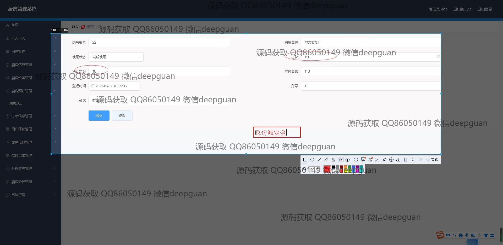
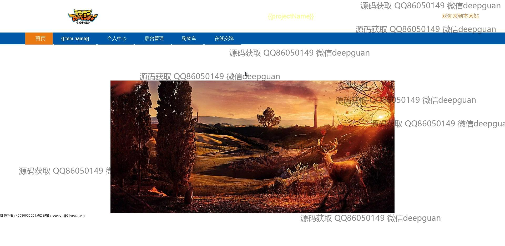

<h1 align="center">基于vue的厨房管理系统+vue</h1>

## 简介
基于Vue的厨房管理系统：角色分为管理员和用户；支持个人中心、用户管理、厨房信息管理、订单信息管理、厨房预订管理、设备管理、用户评价管理、公告发布等功能。界面简洁，便于信息录入与管理。    --计算机毕业设计源码；毕设源码；java毕业设计源码

## 联系方式

<h3 align="center">获取完整代码与数据库文件 + 微信：deepguan QQ: 86050149 QQ群: 783742310</h3>

<h3 align="center">可帮忙远程部署 包运行成功！提供远程部署、修改代码、设计文档指导、代码讲解等服务！</h3>

## 功能介绍（完整见运行截图）
管理员：管理员可以通过登录页面进入系统，进行厨房管理，包括用户管理、订单管理、厨房设备管理和预订管理等功能。管理人员可以查看和编辑用户信息、发布公告、审核厨房信息、管理订单和用户评价、并处理设备的维修记录。界面设计支持快速切换功能模块，用户统计和分析功能优化了管理效率。

用户：用户可以注册和登录进入系统，通过个人中心查看和修改个人信息，进行厨房预订和浏览厨房信息。用户可以填写订单信息，提交服务和厨房评价，查看或删除自己的预订和订单记录。系统提供直观的导航和编辑界面，支持通过搜索功能快速找到相关信息，便于操作提高用户体验。

## 运行截图

本代码来源于网络,仅供学习参考使用!

